

Vous trouverez sur ce site web tout le matériel nécessaire pour les différentes séances des cours, ainsi que quelques pointeurs vers d'autres resources utiles pour les études en informatique.

## Partie 1 : Devenir un·e power user

### 1-1 C’est quoi l’informatique ?

Cette première séance se concentre sur l'ordinateur et la manière dont il traite l'information. Le but de la séance est de ... rendre une planche de plastique capable de faire des additions à ta place ! 😁

[Les slides de la séance sont disponibles ici.](INFOB000-Cours-prepa-session01.pdf)

**Activité *Turing Tumble* :** Vas sur la version en ligne de [Turing Tumble](https://tumble-together.herokuapp.com/) et essaye de résoudre les puzzles \#1, \#5 et \#11 : [https://tumble-together.herokuapp.com/](https://tumble-together.herokuapp.com/).

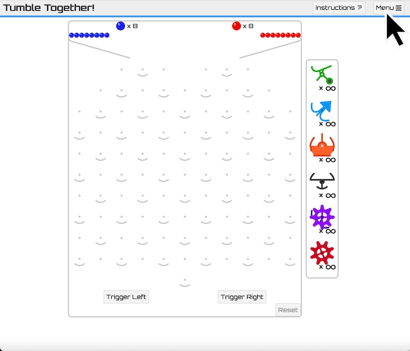
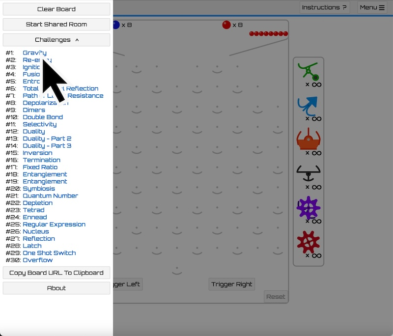

([documentation](https://upperstory.com/turingtumble/assets/educator-guide-2021.pdf))

**Activité *Binary Game* :** Vas sur [https://learningcontent.cisco.com/games/binary/index.html](https://learningcontent.cisco.com/games/binary/index.html) pour résoudre le plus de puzzles le plus vite possible avant que la pile de nouveaux puzzles ne déborde (on parle d'*overflow* en informatique ;-)).

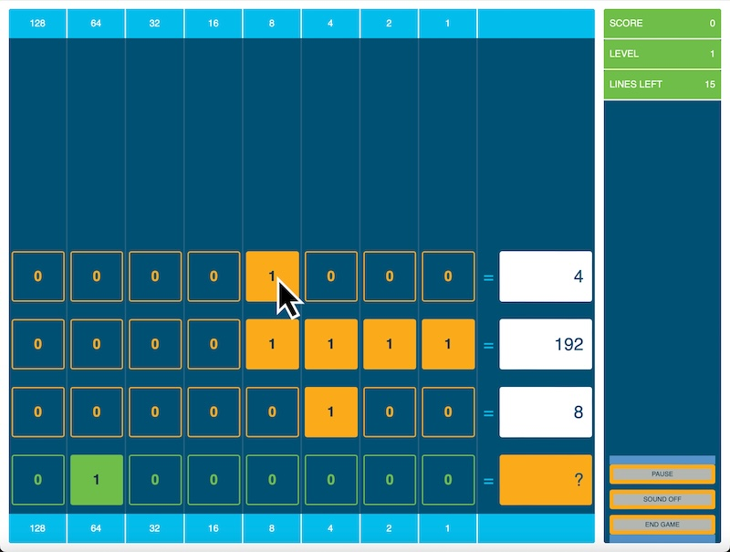

### 1-2 Utiliser l’ordinateur comme un·e power user

Deuxième séance, il est temps de voir comment utiliser un ordinateur comme un·e pro, via un terminal de commande. 😎

[Les slides de la séance sont disponibles ici.](INFOB000-Cours-prepa-session02.pdf)

**Activité *Jeu de piste en ligne de commande* :**

Télécharge le fichier suivant [tresor_chateau.zip](tresor_chateau.zip) et dézipe le dans ton dossier utilisateur (`/home/tonidentifiant/`). Si tu veux le faire sans utiliser la souris, ouvre un terminal de commande et tape les commandes suivantes pour télécharger le fichier sur ta machine depuis le site web :

```bash
cd
wget https://snail.info.unamur.be/course/infoprepa//tresor_chateau.zip
```

La commande `ls` devrait normalement faire apparaître le fichier `tresor_chateau.zip` dans la liste des fichiers. Tu peux maintenant déziper le fichier à l'aide de la commande suivante :

```bash
unzip tresor_chateau.zip
```

La commande `ls` devrait maintenant faire apparaître le dossier `tresor_chateau`. Pour démarrer le jeu, rends toi dans ce dossier et lis le premier indice à l'aide des commandes suivantes :

```bash
cd tresor_chateau
cat panneau01.txt
```

*Pro tip : dans un terminal de commande, la [touche de tabulation](https://fr.wikipedia.org/wiki/Touche_de_tabulation) permet de compléter automatiquement la fin de la commande. Par exemple, `cd tres` + tabulation complétera la commande en `cd tresor_chateau`, pour autant qu'aucun autre dossier commençant par `tres` se trouve dans le répertoire courant.*

(adapté depuis [Le trésor du chateau: Jeu de piste en ligne de commande sous Linux](https://www.enseignons.be/preparation/86760/) de Cédric Libert)

**Resources supplémentaires** :

- [Bash scripting cheatsheet](https://devhints.io/bash)
- [Introduction au Script Bash (avec exemples)](https://www.hostinger.fr/tutoriels/introduction-au-script-bash-avec-exemples)

------------------------------------------------------------

## Partie 2 : Devenir un·e développeur·euse

### 2-1 Introduction à l’algorithmique

Lors de la dernière séance, nous avons vu avec vous les briques de base de la programmation. Ces briques apparaissent dans la plupart des langages de programmation ([impérative](https://fr.wikipedia.org/wiki/Programmation_impérative)) comme le Python ou le Java. Pour faciliter les choses, on te propose de sauvegarder la *cheat sheet* (*aide-mémoire* en français) suivante qui reprends les différents concepts (une [version .pdf est disponible ici](cheatsheet-bases-programmation.pdf)) :

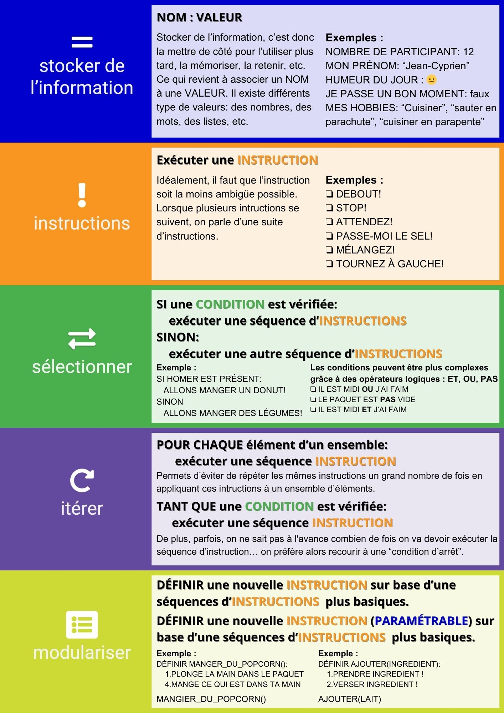

Le but de cette troisième séance est de voir comment combiner ces briques de base pour passer d'une tâche à automatiser au programme qui l'automatisera. Et pour cela, on va utiliser l'exemple ci-dessous. 👇

[Les slides de la séance sont disponibles ici.](INFOB000-Cours-prepa-session03.pdf)

**Exemple *Financement participatif* :** Cet exemple est utilisé dans le cours pour illustrer les différentes étapes de la conception d'un algorithme permettant d'automatiser une tâche donnée. Voici l'énoncé de l'exercice en français :

> Sur une plateforme de financement participatif, chaque utilisateur·trice décide librement d’un montant qu’il ou elle souhaite investir dans un projet qui lui tient à cœur. L’utilisateur·trice reçoit en retour certains avantages en fonction de la somme investie. Ces avantages sont cumulatifs : une personne qui investit 100€ a droit à recevoir au moins les même avantages qu’une personne qui investit 99€ ou moins.
>
> Dans le cadre d’une campagne pour lancer une nouvelle artiste, vous devez implémenter une suite d’instructions qui, à partir d’un montant donné, affiche les avantages octroyés suivants :
>
> - à partir de 50€ : envoi d’un poster dédicacé (avantage 1);
> - à partir de 500€ : possibilité de passer 30 minutes avec l’artiste (avantage 2);
> - à partir de 5000€ : concert privé pour max. 20 personnes de votre choix (avantage 3).
> - Si l’utilisateur·trice ne donne pas suffisamment pour avoir un avantage, il faut l’avertir.

**Activité *Bootstrapping your Python skills* :** Pour découvrir le langage Python, on te propose d'aller sur le [Jupyter Notebook créé par nos soins](https://colab.research.google.com/drive/15CcHpemDYJcn2KOhdoFAEEY-riRKAXQ2?usp=sharing). Les *notebooks* (ou *calepins* en français) sont des environnement de développement dédiés à l'apprentissage d'un langage de programmation. Ce calepin a été conçu pour découvrir les bases du langage Python.

Pour te faciliter la vie par la suite, voici une *cheat sheet* avec les briques de base de la programmation en Python (une [version .pdf est disponible ici](cheatsheet-bases-python.pdf)) :

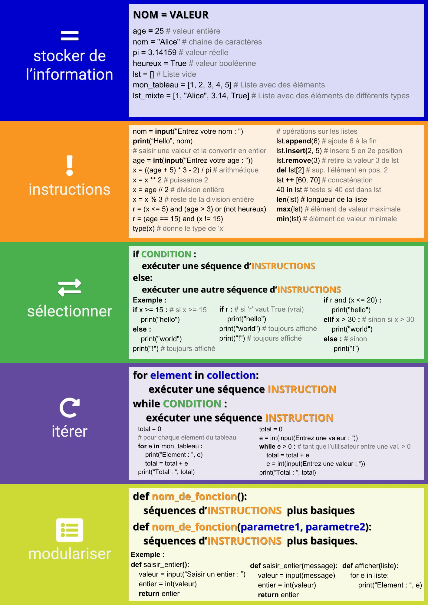

### 2-2 L'environnement de développement

Dernière séance, pour se familiariser avec l'environnement de développement intégré (EDI) [Visual Studio Code](https://code.visualstudio.com), utilisé en première année, on te propose de suivre un mini tutoriel pour te présenter quelques fonctionnalités de base. Tu te rendras vite compte que les EDIs sont des outils puissants, personnalisables à volonté. N'hésites donc pas à explorer par toi même et voir ce qu'il est possible de faire avec.

**Les bases :** La première étape lorsque l'on veut programmer en Python est d'installer le plugin Python via le panneau *Extensions*. L'installation du plugin Python devrait également déclencher l'installation du plugin Python Debugger :


Une fois le plugin installé, tu peux revenir à l'explorateur pour ouvrir un dossier dans lequel on va placer les fichiers `.py` (ou via le menu `Fichier` -> `Ouvrir le dossier...`).  On te conseille vivement de commencer par là afin de ne pas perdre des fichiers dans les différents coins du disque dur de ta machine.


Il est maintenant temps de créer un premier fichier avec l'extension `.py` via un clic droit dans l'explorateur -> `Nouveau fichier...`. N'oublie pas que le nom du fichier doit se terminer par `.py` pour indiquer à ta machine qu'il s'agit d'un fichier Python.

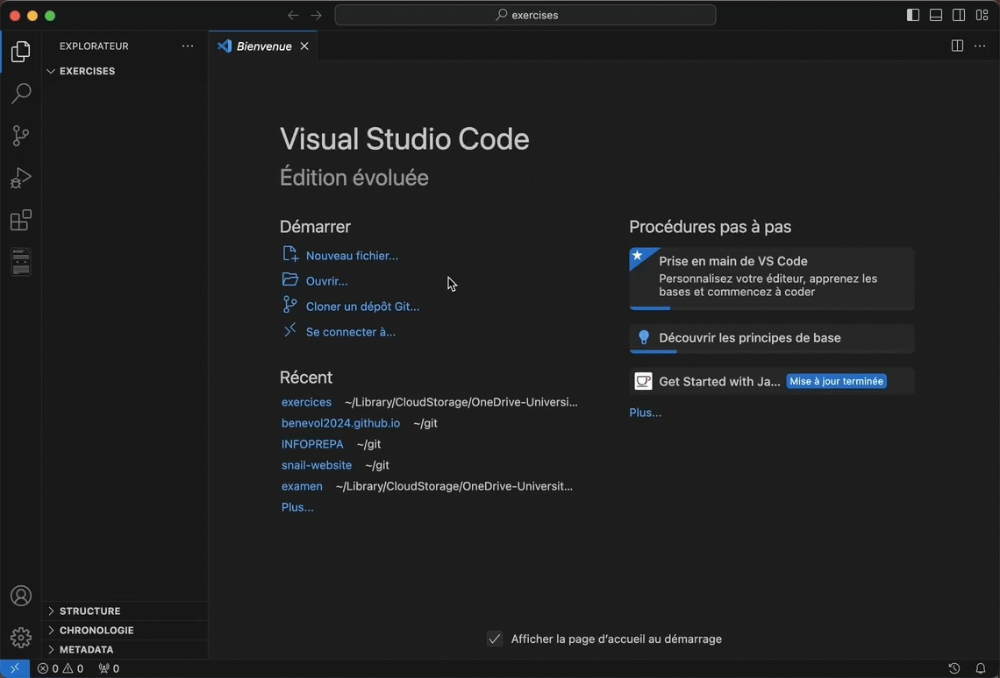

Écrivons maintenant un premier programme qui affichera le message `Hello World!` dans le terminal et exécutons le. Tu peux copier et coller le code suivant dans le fichier que tu viens de créer :

```python
print("Hello World!")
```

Une fois fait, n'oublie pas de sauver le fichier (`CTRL` + `s` sur Windows et Linux ou `Command` + `s` sur Mac). Tu peux maintenant lancer l'interpréteur Python pour qu'il exécute ton fichier, soit via le bouton play en haut à droite de la fenêtre, soit en faisant un clic droit sur ton fichier -> `Exécuter le fichier Python dans le terminal`.

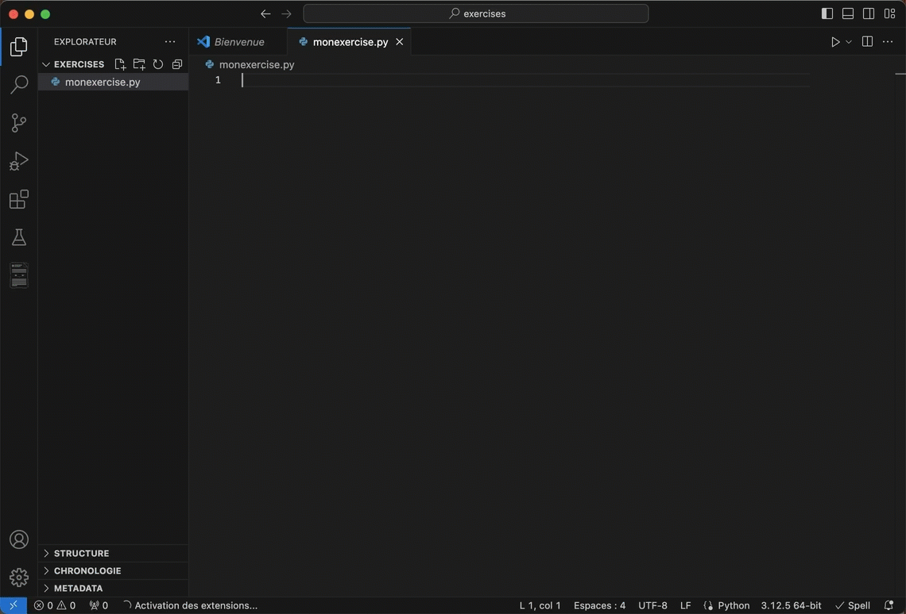

**Renommer une variable et naviguer dans le code :** Pour la suite, tu vas avoir besoin de créer un nouveau fichier (par exemple, `deviner.py`) et d'y ajouter le code suivant :

```python
import random

# Générer un nombre aléatoire entre 1 et 100
d = random.randint(1, 100)
f = False

print("Bienvenue dans le jeu de devinette!")
print("J'ai choisi un nombre entre 1 et 100. Pouvez-vous le deviner?")

while not f:
    # Demander à l'utilisateur de saisir un nombre
    n = int(input("Entrez votre nombre: "))
    
    if n < d:
        print("C'est plus grand!")
    elif n > d:
        print("C'est plus petit!")
    else:
        print(f"Bravo! Vous avez deviné le nombre {d}.")
        f = True
```

On te laisse le soin de deviner ce que fait ce bout de code. :-) Comme tu peux le voir, les noms de variables ne sont pas très explicites. Une bonne pratique lorsque l'on programme consiste à donner des noms qui peuvent renseigner un autre programmeur lisant le code sur ce que cette variable représente. Par exemple, la variable `d` est la valeur aléatoire comprise entre 1 et 100 que l'utilisateur doit deviner. Heureusement, les EDIs permettent de renommer facilement une variable. Pour cela, il te suffit de sélectionner la variable à un endroit de ton code, clic droit -> `Renommer le symbole`.

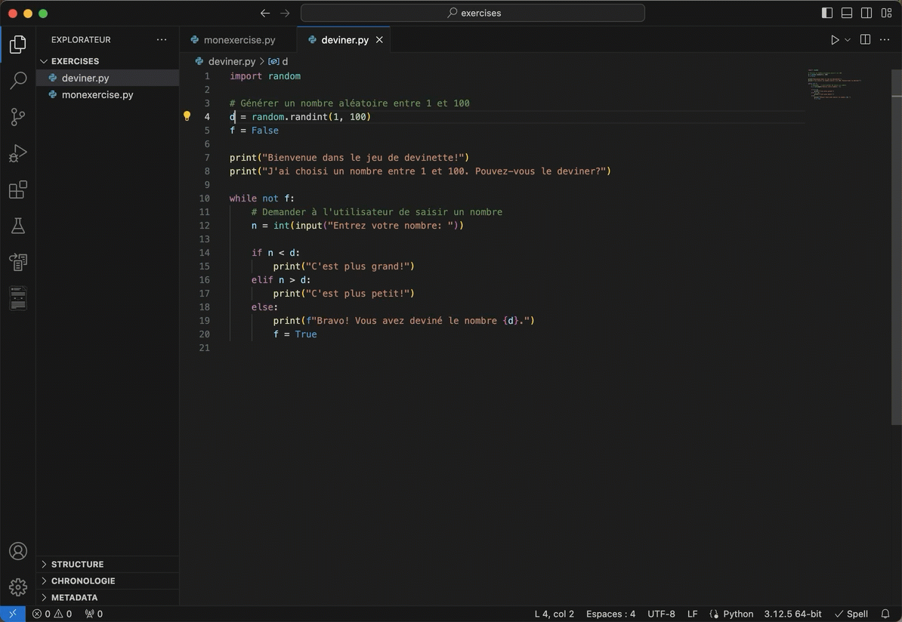

Une fois renommé, tu remarqueras que l'EDI a pris soin pour toi d'utiliser le même nom aux différents endroits où le symbole apparaît. On te laisse le soin de renommer les autres variables avec des noms plus adéquats. La fonction de renommage est souvent utilisée par les développeurs, que ce soit pour renommer des variables, des modules, des fonctions, etc.

Afin de comprendre ce que fait une variable et de lui donner un meilleur nom, il est parfois nécessaire de voir comment la variable a été définie (on parle aussi de déclaration de variable) et utilisée dans le code. Un EDI permet de naviguer facilement dans un code source de différentes manières. Par exemple, pour aller à la déclaration d'une variable, il te suffit de faire un clic droit -> `Atteindre la définition`.


Cette fonctionnalité est très pratique lorsque l'on a un code source important et qu'il n'est pas clair où une variable est définie pour la première fois. L'EDI permet également de naviguer vers les différents endroits où une variable est utilisée, ce qui est pratique pour comprendre à quoi celle-ci sert dans le code. Pour cela, il suffit de clic droit sur la variable -> `Atteindre les références` pour ouvrir une fenêtre dans l'éditeur reprenant les endroits où la variable est utilisée et/ou modifiée.

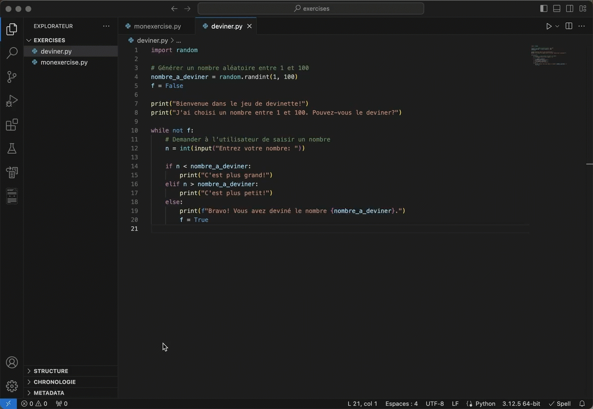

**Extraire une fonction :** Contrairement à ce que tu pourrait croire, écrire un morceau de code (qui fera partie d'un programme) ne se fait pas en une fois. En général, on écrit une première version du code que l'on va retravailler pour diverses raisons : améliorer sa lisibilité, optimiser son exécution ou encore regrouper les bouts de code similaires, voire identiques dans une fonction (il s'agit de *modulariser* le code). C'est ce que l'on appelle communément du *refactoring* de code (ou *refactorisation* en français). Pour améliorer la lisibilité, nous venons de voir comment, par exemple, renommer une variable. Ton EDI te permet d'aller plus loin, par exemple, en extrayant une fonction d'un morceau de code existant. Pour cela, il faut sélectionner le morceau de code en question, cliquer sur la petite ampoule qui apparaît 💡 -> `Méthode d'extraction`.

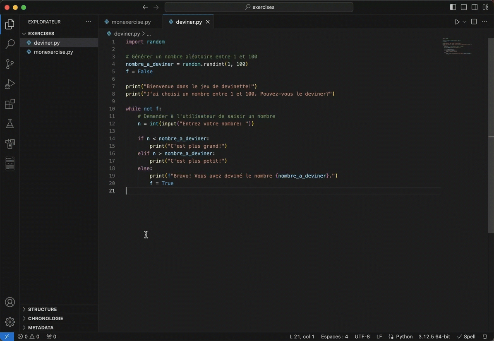

Une fois extraite, tu peux rendre la fonction plus modulaire en ajoutant, par exemple, un paramètre.

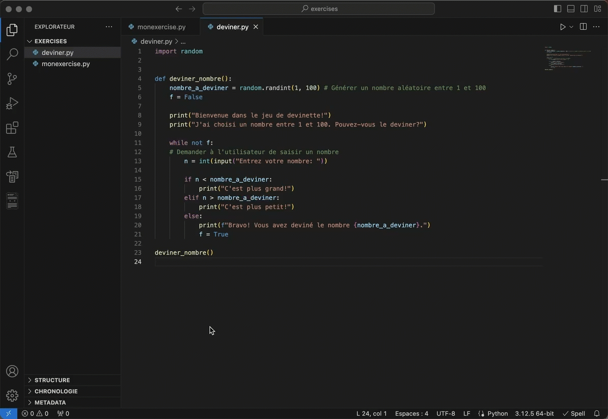

La fonction d'auto complétion de l'EDI te facilitera la vie en te proposant différentes options. Dans ce cas-ci, le paramètre `valeur_max` qui vient d'être déclaré dans l'entête de la fonction (`def deviner_nombre(valeur_max)`).

**Poser un diagnostic en cas d'erreur :** En cas d'erreur lors de l'exécution d'un programme Python, l'interpréteur donnera quelques indications. Si tu exécutes le programme de la vidéo précédente, l'interpréteur provoquera une erreur avec le message suivant : `deviner_nombre() missing 1 required positional argument: 'valeur_max'`. Celui ci nous dit qu'il manque un argument lors de l'appel à `deviner_nombre()`. Les messages d'erreur peuvent paraître assez cryptiques au début, mais renseignent en général assez bien sur ce qui ne va pas. N'hésite jamais à le traduire en français si l'anglais n'est pas (encore ;-)) ton point fort ou à copier et coller le message d'erreur dans ton moteur de recherche préféré pour avoir plus d'information.


Un autre élément intéressant du message d'erreur est la localisation (probable) de cette erreur : `File: "/Users/.../deviner.py", line 23, in <module> deviner_nombre()`. En passant ta souris sur <u>`"/Users/.../deviner.py", line 23`</u>, ton EDI t'indiques que tu peux te rendre à l'endroit renseigné (via `cmd` + clic sur Mac), ce qui facilite le diagnostic et la correction de l'erreur. Dans ce cas ci, il suffit simplement d'ajouter une valeur lors de l'appel à `deviner_nombre()`. Par exemple, `deviner_nombre(100)` fera deviner un nombre entre 1 et 100 à l'utilisateur.

**Documenter le code :** Lorsque l'on programme, il est important de documenter son code. Tu as sans doute remarqué les commentaires précédés d'un dièse `#` dans le code que nous t'avons fourni plus haut. Ces commentaires renseignent sur les différentes étapes du code, par exemple lors de l'appel à une fonction externe comme `randint`. Ces commentaires sont ignorés par l'interpréteur Python. Autrement dit, si tu veux qu'une ligne de code ne soit pas exécutée sans pour autant la supprimer, ajouter un dièse `#` au début de la ligne et l'interpréteur l'ignorera.

Maintenant, si tu passes le curseur de ta souris sur `randint`, l'EDI t'affichera une fenêtre reprenant l'entête de la fonction, ainsi qu'une phrase décrivant ce que fait cette fonction :

```python
(variable) def randint(
    a: int,
    b: int
) -> int
Return random integer in range [a, b], including both end points.
```

Voyons comment faire pour documenter la fonction `deviner_nombre` que l'on vient de définir. Tout d'abord, on va installer le plugin [*autoDocstring*](https://marketplace.visualstudio.com/items?itemName=njpwerner.autodocstring) qui permet de générer une "*Docstring*". Il s'agit d'une chaîne de caractères spéciale (comprise entre `"""` et `"""`) avec la documentation de la fonction. Il existe plusieurs formats de docstring. Dans notre cas, nous utiliserons le format `numpy`, qui est à renseigné dans les paramètres de l'extension.


Une fois le plugin installé et configuré, tu peux revenir dans le code et positionner ton curseur à la ligne en dessous de la fonction `deviner_nombre`. En tapant `"""`, tu vas voir l'autocompletion te proposer la génération d'un docstring au format `numpy`. Il ne te reste alors qu'à compléter la documentation en renseignant les informations pour les différents champs indiqués.


Si tu passes ta souris sur la fonction `deviner_nombre`, tu devrais maintenant voir apparaître la documentation :

```python
(function) def deviner_nombre(valeur_max: Any) -> None
Fonction qui fait deviner un nombre entre 1 et valeur_max.

Parameters
   valeur_max : int
   La valeur maximale que peut prendre le nombre à faire deviner.
```

**Afficher l'historique des modifications :** Bon, après toutes ces modifications, il te sera parfois nécessaire de devoir revenir en arrière (ou simplement de voir ce qui a changé dans le fichier). Là encore, l'EDI peut t'aider. Il est pourvu d'un mécanisme local permettant d'enregistrer des versions intermédiaires d'un fichier. Pour cela, rien de plus facile, clic droit sur un fichier -> `Ouvrir la chronologie` pour afficher une liste des versions précédentes. En cliquant sur une version, l'EDI ouvrira une fenêtre permettant de comparer la version courante à cette version précédente.


Ce mécanisme bien pratique a toutefois un gros désavantage : il est local. Ce qui veut dire que si tu déplaces ou renomme le fichier, il est perdu. Tu ne peux pas non plus envoyer le fichier avec son historique à quelqu'un d'autre ou collaborer à plusieurs sur le même fichier.

Pour cela, tu vas avoir besoin d'un autre outil : [Git](https://git-scm.com), un système de gestion de versions. 😉

## Autres resources utiles

- [Éduquer au numérique. 12 clés pour comprendre l'informatique](https://www.politeia.be/fr_BE/shop/18533-eduquer-au-numerique-12-cles-pour-comprendre-l-informatique-11619) (livre, aussi disponible en prêt à la [BUMP](https://www.unamur.be/fr/bump))
- [Pro Git (2è édition)](https://git-scm.com/book/fr/v2/)
