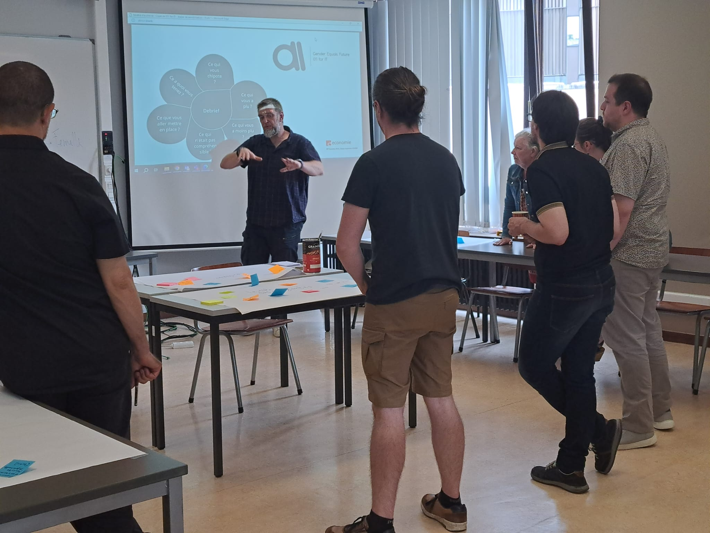

On July 4, the faculty's teaching staff participated in a half-day training session on gender questions and representations in Computer Science courses. This training is part of the results of the research project Gender Equals Future: 011 for IT, in which Interface3.Namur, Form@Nam and the University of Namur are partners. It was an opportunity to take a closer look at the situation, based on figures taken from the annual report on gender equality at the University of Namur (2020-2021), and to break down a few clichés about women's involvement in computer science studies and the academic world. Participants were also introduced to the difference between the concepts of sex and gender, common cognitive biases, and stereotypes. The training ended with a brainstorming session on some practical actions to be implemented at the faculty.

