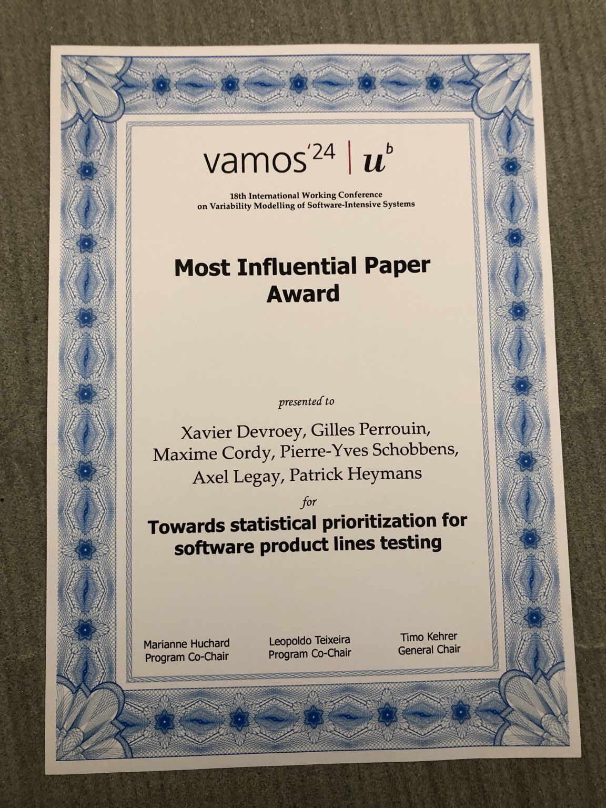

On Thursday, February 8, 2024, I, together with Gilles Perrouin and Maxime Cordy, received the Ten-years Most Influential Paper award at the 18th International Working Conference on Variability Modelling of Software-Intensive Systems (VAMOS '24) in Bern, Switzerland. The award recognizes our paper "Towards statistical prioritization for software product lines testing", also published with Pierre-Yves Schobbens, Axel Legay and Patrick Heymans, for its impact on the research community over the last ten years. The paper presented and published at VAMOS '14 describes a (then) new method for prioritizing configurations and behaviors to be tested based on one or more files describing the behavior of highly configurable components. At the time of publication, I was a PhD assistant at the Faculty of Computer Science. After a 4-year postdoc at TU Delft in the Netherlands, I returned as an assistant professor at the Faculty of Computer Science in 2021. Gilles Perrouin was a postdoctoral fellow in the same faculty before obtaining a position as a Qualified Researcher at the FNRS in 2017. Maxime Cordy completed his thesis at the Faculty of Computer Science and is now a permanent researcher at the Interdisciplinary Research Centre on Security, Reliability and Trust (SnT) at the University of Luxembourg.

