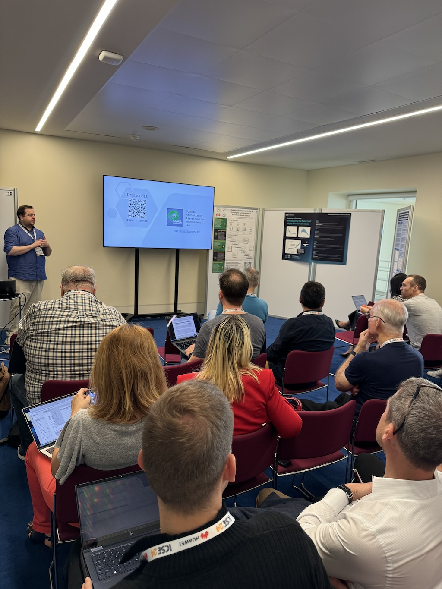

The week of April 15, we were in Lisbon for the 46th edition of the International Conference on Software Engineering (ICSE 2024 🇵🇹). Since 1975, ICSE has provided a forum where researchers, developers and educators come together to present and discuss the latest innovations, trends, experiences and problems in the field of software engineering. Given the current state of the art, it's fair to say that this year was largely devoted to Large Language Models (LLMs), such as ChatGPT. Numerous presentations showed how these can (or cannot) be used to simplify developers' lives or advance software engineering research. 🤔 In addition to the scientific presentations, ICSE week with its many co-located events is an opportunity to meet the whole software engineering research community in one place and build bridges with other international research groups. Master students in computer science will soon be taking advantage of this for their end-of-study internships, which can be carried out abroad with one of these groups. 😉

The SNAIL team was represented by Martin Balfroid, who presented his research on the use of LLMs to improve the integration of new developers into development projects via the [automatic generation of code tours in a code editor](/publication/balfroid-2024/). Xavier Devroey presented the work of Nicolas Riquet, also a doctoral student on the team, who was unable to attend, on the use of [Debt Stories: Capturing Social and Technical Debt in the Industry](/publication/riquet-2024/), a tool for collecting information on socio-technical debt from the various stakeholders in a development project. 
