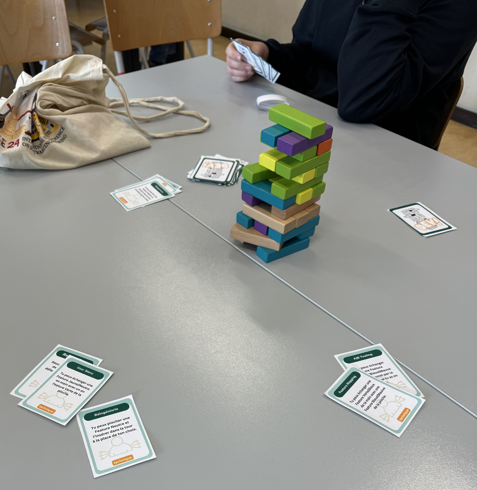

How do you get 4th graders (16yo.) to understand software engineering in 1h30? That's the challenge we (Jérôme Maquoi, Benoît Vanderose and Xavier Devroey) set ourselves on Thursday April 25, 2024. Rather than making them write code, we chose another route: get them to build a 16-floors tower of wooden blocks in under 32 minutes with constraints similar to a software development team in full rush. 😁

After an introduction by Benoît Vanderose to set the scene, it was time to play. The least we can say is that it worked pretty well! Just as in a development project, the foundations were pretty solid in the majority of groups. But as time progressed and difficulties arose (discovery of bugs, user requests for modifications, etc.), each group made its own choices to win the day... with sometimes unexpected consequences.

If you're interested in this activity, don't hesitate to [contact us](/aboutsnail/#contact)! 😉
