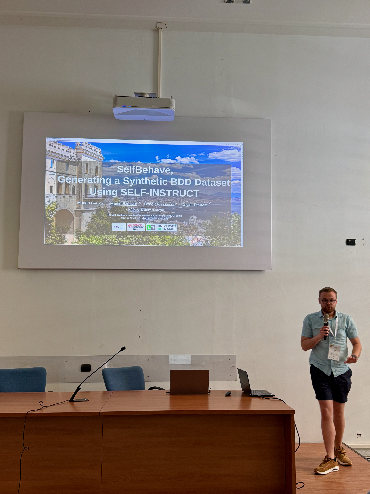
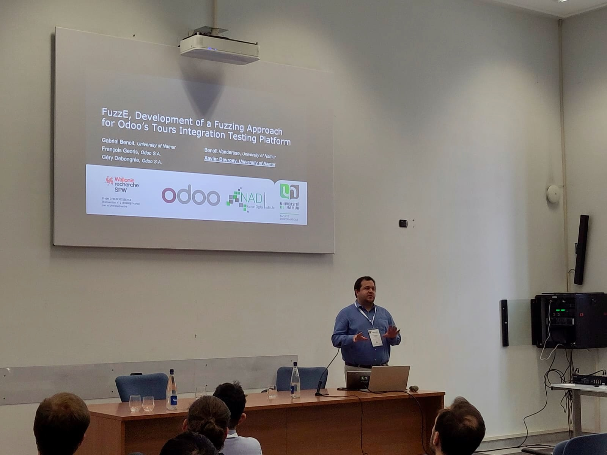

This week, two members of our team are attending the IEEE International Conference on Software Testing, Verification and Validation (ICST 2025) in Naples, Italy. On Monday, Balfroid Martin took the stage to share research conducted by Manon Galloy, a SNAILee who defended her master's thesis in 2024. The focus of their presentation was on a novel technique known as SelfBehave, aimed at synthesizing user stories, which was featured during the A-MOST workshop.

The goal of this research is to enhance existing Behavior-Driven Development (BDD) datasets to better fine-tune smaller models. The paper detailed how the team assessed the impact of initial BDD scenarios on the quality of the synthetically generated alternatives. The findings revealed that while the quality of seed scenarios did not markedly affect the generation of complete and essential scenarios, it did influence the scenarios' ability to center on a single action and outcome, as well as their adherence to Gherkin syntactic rules. Additionally, it was noted that although raters were in agreement about the overall quality of the scenarios, there was significant divergence in their evaluations of individual criteria. This highlights a need for more straightforward quality criteria that can be more easily applied in practice.

As a side note, it is essential to verify that the license of any Large Language Model (LLM) used permits the reuse of generated synthetic data for model tuning.

For more details, the paper and additional information are available [on our website](https://snail.info.unamur.be/publication/galloy-2025/).

In a second presentation at ICST 2025 on Wednesday, Xavier Devroey presented research by Gabriel Benoit, another SNAILee who also defended his master's thesis in 2024. Gabriel's work focused on applying fuzzing techniques for system testing at Odoo, an open-source platform that provides a wide array of functionalities for small and medium businesses. This presentation took place during the conference's Industry Track, which emphasizes collaboration between academic research and industry initiatives to implement cutting-edge testing methods.

During his internship at Odoo, Gabriel adopted an iterative approach to develop a plugin called FuzzE for Odoo's system testing tool. The results indicated that mutational fuzzing, which involves altering existing tests by adjusting the input values, emerged as the most effective strategy when integrated with the existing testing framework.

Follow-up research is already underway! Salvio Strazzante, a 2025 SNAILee, is currently on an internship at Odoo and is working diligently to further the findings of this project. Stay tuned for updates on his progress!

For more information and to access the paper, visit [our website](https://snail.info.unamur.be/publication/benoit-2025/).
